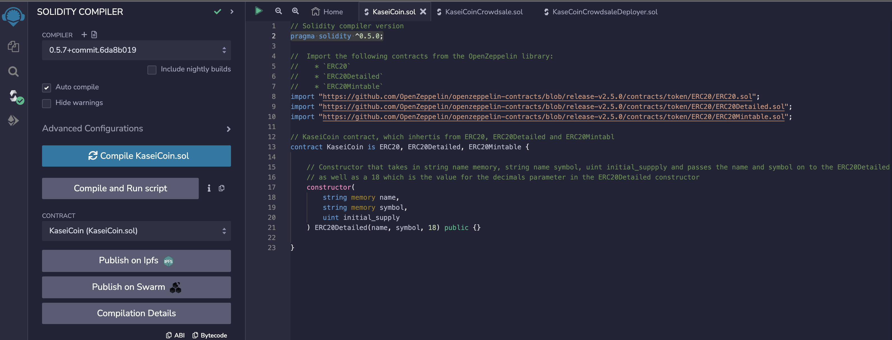
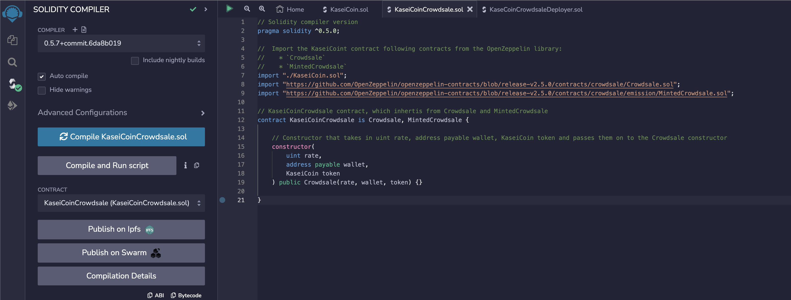
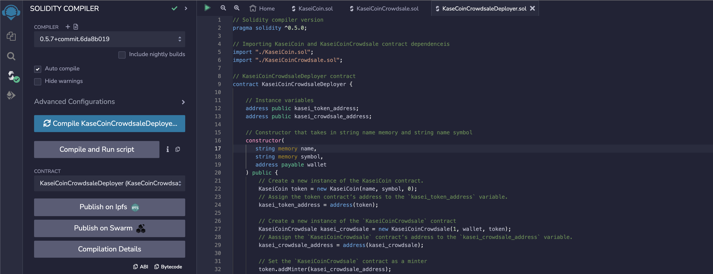
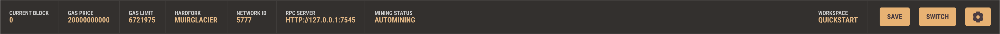
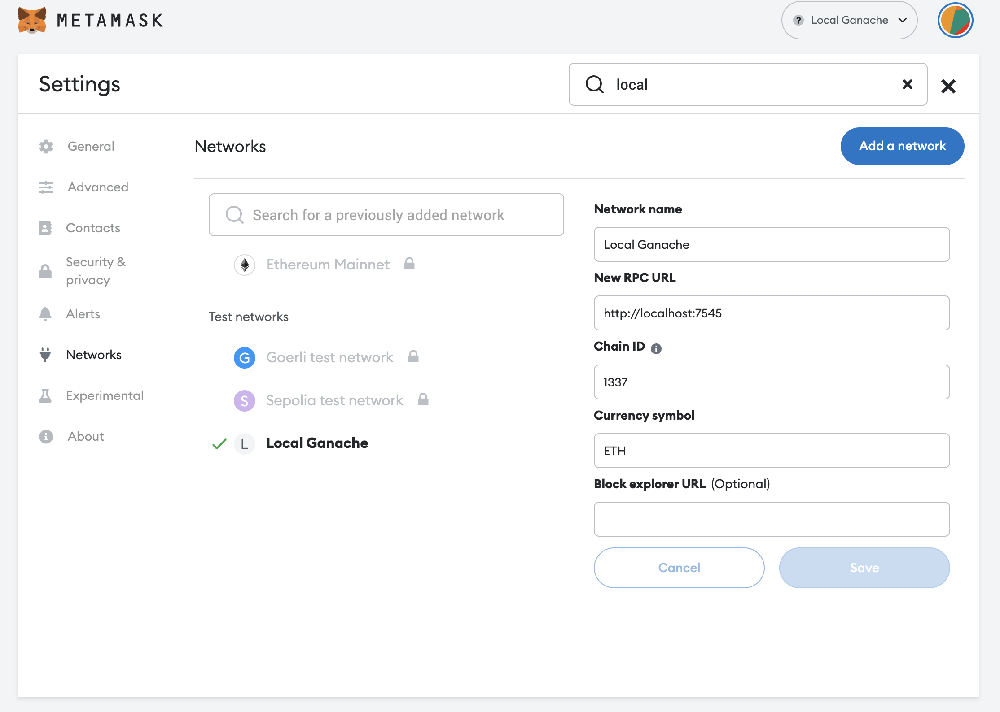
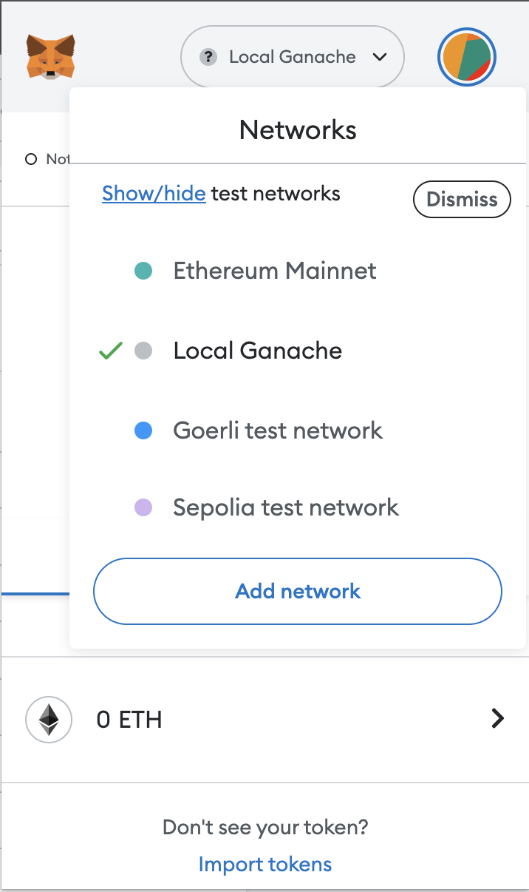
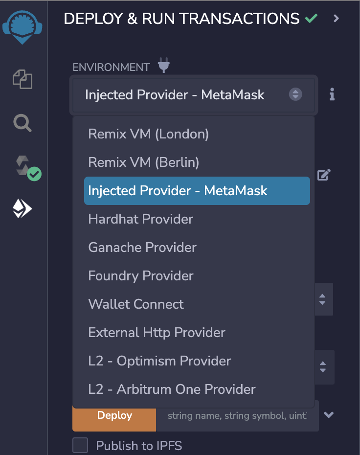

# Martian Token Crowdsale


## Background

After waiting for years and passing several tests, the Martian Aerospace Agency selected you to become part of the first human colony on Mars. As a prominent fintech professional, they chose you to lead a project developing a monetary system for the new Mars colony. You decided to base this new system on blockchain technology and to define a new cryptocurrency named **KaseiCoin**. (Kasei means Mars in Japanese.)

KaseiCoin will be a fungible token that’s ERC-20 compliant. You’ll launch a crowdsale that will allow people who are moving to Mars to convert their earthling money to KaseiCoin.

## Evaluation Evidence

### Contract Compilation

#### KaseiCoin Token Contract Compilation


#### KaseiCoinCrowdsale Contract Compilation


#### KaseiCoinCrowdsaleDeployer Contract Compilation


### Local Blockchain

#### Ganache Credentials


#### Ganache/Meta Mask Network Setup


#### Meta Mask Connected to Ganache Network


#### Switching to the Meta Mask Injected Provider in the Remix IDE


## Getting Started

1. Open the Remix IDE here: [Remix IDE](https://remix.ethereum.org/)
2. Copy and paste the code from [KaseiCoin.sol](https://github.com/SZun/Martian-Token-Crowdsale/blob/main/contracts/KaseiCoin.sol), [KaseiCoinCrowdsale.sol](https://github.com/SZun/Martian-Token-Crowdsale/blob/main/contracts/KaseiCoinCrowdsale.sol) into files in the Remix IDE.
3. Compile the contracts
4. Deploy the contracts

## Clone Repository
```
$ git clone git@github.com:SZun/Martian-Token-Crowdsale.git
$ cd Martian-Token-Crowdsale
```

## Built With
[]([https://docs.soliditylang.org/en/latest/) *Programming Language* <br>
[]([https://docs.soliditylang.org/en/latest/) *Open-Source Solidity Contract Standards*


## Contributors
- **Sam G. Zun** - [LinkedIn](https://www.linkedin.com/in/szun/) | [GitHub](https://github.com/SZun)
